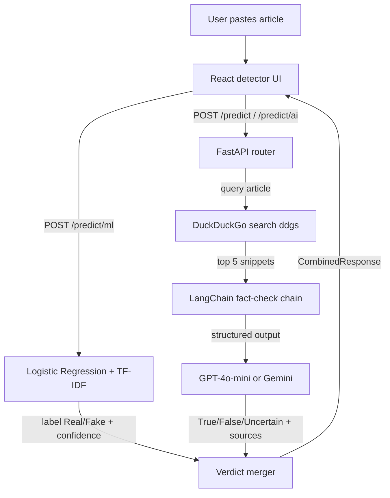

<div align="center">


# FakeNews Detector

**Dual-engine news verification** — a local scikit-learn (Logistic Regression) classifier plus LLM fact-checking with live web sources, behind one FastAPI + React app.


</div>

---

## 📌 Table of Contents

- [🎯 Problem](#-problem)
- [💡 Solution](#-solution)
- [🏗️ Architecture](#️-architecture)
- [⚙️ Tech Stack](#️-tech-stack)
- [🔑 Key Engineering Decisions](#-key-engineering-decisions)
- [🖼️ Screenshots](#️-screenshots)
- [🚀 Demo](#-demo)
- [📦 Installation](#-installation)
- [📡 API Documentation](#-api-documentation)
- [📊 Evaluation](#-evaluation)
- [☁️ Deployment](#️-deployment)
- [⚠️ Limitations](#️-limitations)
- [🔮 Future Improvements](#-future-improvements)

---

## 🎯 Problem

Misinformation spreads faster than manual fact-checking can keep up with. A reader who wants to verify a suspicious article today has two bad options: **trust their gut**, or **spend 20 minutes** cross-searching claims across news sites.

Single-signal tools don't help much either. Keyword heuristics and browser extensions rely on one detection method, so they are either trivially fooled or too slow/opaque to be useful at the moment of sharing.

---

## 💡 Solution

FakeNews Detector verifies any pasted article in seconds by running an on-device statistical model **and** an LLM-powered web fact-check, then merging the verdicts into one explainable answer.

| Mode | How it works | API Key required |
|------|-------------|:---:|
| 🧠 **Combined** | Runs both engines and reconciles agreement/disagreement with boosted confidence and a written rationale | Optional |
| ⚡ **ML-only** | Instant Logistic Regression + TF-IDF classification (Real/Fake), fully offline | ❌ |
| 🌐 **AI-only** | Searches the live web via DuckDuckGo, feeds evidence to GPT-4o-mini or Gemini, returns True/False/Uncertain with cited sources | ✅ |
| 🔑 **BYOK Settings** | Users store GPT or Gemini keys locally in the browser; requests forward them per-call | — |
| 📂 **Local History** | Every run is saved in `localStorage` and restorable with one click; no accounts, no server-side storage | ❌ |

---

## 🏗️ Architecture

```
frontend/          React 18 SPA (Vite) — 4 routes: Landing, /detector, /features, /about
    │
    ├──▶ POST /api/v1/predict/ml    →  Logistic Regression + TF-IDF (offline, instant)
    ├──▶ POST /api/v1/predict/ai    →  DuckDuckGo → LangChain → GPT-4o-mini / Gemini
    └──▶ POST /api/v1/predict       →  Both engines → Verdict merger → CombinedResponse
            │
            ▼
    backend/app/     FastAPI router (3 POST endpoints + /health)
    │
    ├── services/ml_predictor.py    — loads model.pkl + vectorization.pkl via joblib
    ├── services/predictor.py       — AI pipeline orchestrator
    ├── services/searcher.py        — DuckDuckGo web search (top 5)
    ├── core/llm.py                 — LangChain client (lazy init per provider+key)
    └── api/routes.py               — rule-based ML + AI verdict fusion
```

<details>
<summary><strong>🔀 Full Mermaid Flowchart</strong></summary>



</details>

---

## ⚙️ Tech Stack

| Layer | Technology | Purpose |
|-------|-----------|---------|
| Frontend |    | Fast SPA with route-level code splitting and instant HMR |
| Styling |   | CSS-variable design tokens (dark forest-green); declarative page transitions |
| Backend |   | Async endpoints, automatic OpenAPI docs, native ASGI |
| ML |   | Logistic Regression + TF-IDF baseline that runs fully offline and returns calibrated probabilities |
| AI |    | Provider swap is one class; structured output enforces schema |
| Search |  | Free, keyless evidence gathering for fact-checking |
| Storage | Pickle artifacts + browser `localStorage` | Zero infrastructure; nothing user-owned lives on the server |
| Deploy |  | One Vercel project with two services (Vite SPA + FastAPI function) |

---

## 🔑 Key Engineering Decisions

| Decision | Approach | Trade-off |
|----------|----------|-----------|
| **BYOK credentials** | `provider`/`api_key` travel in each request body and override env vars | Keys transit the server on every AI call |
| **Lazy LLM init** | Clients built on first use per `(provider, key)` pair | First AI request pays cold-start latency |
| **Rule-based fusion** | Agreement → boosted confidence; disagreement → AI defers for "False" | Interpretable and tunable, not statistically optimized |
| **Structured outputs** | Pydantic `with_structured_output(NewsResponse)` enforces schema | Depends on provider support for schema-constrained decoding |
| **`localStorage`** | History and settings never leave the browser | Device-bound and cleared with site data |
| **Split-hosting services** | Frontend (Vite) and backend (FastAPI) deploy as two Vercel services joined by rewrites | Cross-service `/api` proxy; the two deploy independently |
| **Same-origin `/api` proxy** | Frontend calls relative `/api/v1`; dev server proxies to `127.0.0.1:8000`, production rewrites to the backend service | No CORS config or per-env API base URL needed in the browser |
| **Non-blocking ML** | `predict_ml` runs the CPU-bound load/predict in a thread executor (`loop.run_in_executor`) | Keeps FastAPI's event loop responsive for concurrent requests |

---

## 🚀 Demo

**Live deployment:** [https://fake-news-detection-git-main-mouzan-razas-projects.vercel.app/](https://fake-news-detection-git-main-mouzan-razas-projects.vercel.app/)

The app is deployed end-to-end on Vercel as two services (Vite frontend + FastAPI backend) sharing one domain.

To capture a demo GIF: paste any news paragraph in **Combined** mode and record the loading steps through the merged-verdict result screen (`docs/demo.gif`).

**Fastest local look after a prior build:**

```bash
cd backend/app && uvicorn main:app --port 8000
# open http://127.0.0.1:8000
```

---

## 📦 Installation

**Prerequisites:**   

```bash
git clone https://github.com/Dev-with-Mouzan/fake-news-detection.git
cd fake-news-detection
```

**1. Backend dependencies**

```bash
cd backend/app
python -m venv .venv
source .venv/bin/activate        # Windows: .venv\Scripts\activate
pip install -r requirements.txt
```


**2. Optional env config** — copy `backend/.env.example` to `backend/app/.env` and fill `OPENAI_API_KEY` and/or `GOOGLE_API_KEY` (server-side fallbacks; users can also supply keys in-app via Settings).

**3. Frontend build (optional — for a combined local preview)**

```bash
cd ../../frontend
npm install
npm run build        # outputs frontend/dist; served by FastAPI if present (for a single-port local preview)
```

**4. Run**

```bash
cd ../app
uvicorn main:app --reload --port 8000
```

> Combined preview: open [http://127.0.0.1:8000](http://127.0.0.1:8000) (FastAPI serves the built SPA when `frontend/dist` exists). For frontend hot-reload during development, use `npm run dev` in `frontend/` — it serves `:5173` and proxies `/api` to `127.0.0.1:8000`.

---

## ☁️ Deployment

The project deploys as a **single Vercel project with two services** (frontend + backend) sharing one domain, wired together by the rewrites in the root `vercel.json`.

| Service | Root | Framework | Entrypoint |
|---------|------|-----------|-----------|
| **Frontend** | `frontend` | Vite | — |
| **Backend** | `backend/app` | Python (FastAPI) | `main:app` |

### How routing works

Root `vercel.json` routes `/api/*` to the backend service and every other path to the frontend service, so the SPA calls the API same-origin (no CORS, no per-env API base URL).

### Deploy steps

1. Push to GitHub.
2. Import the repo on [vercel.com](https://vercel.com).
3. Set the project's **Framework Preset** to **Services** (required for the `services` key in `vercel.json` to take effect).
4. Add environment variables to the **backend** service (or project level): `OPENAI_API_KEY`, `GOOGLE_API_KEY` (optional — users can also supply keys in-app).
5. Add `NLTK_DATA=/tmp/nltk_data` so NLTK can download its corpora on the read-only serverless filesystem (a default is also set in `backend/app/main.py`).

### Local dev against the deployed backend

```bash
cd frontend
npm run dev        # proxies /api to http://127.0.0.1:8000
```

---

## ⚠️ Limitations

| Issue | Detail |
|-------|--------|
| 🎛️ Fusion rules | Hand-tuned heuristics, not learned weights; adversarial disagreements resolve by fixed precedence |
| 🌐 Search quality | Free DuckDuckGo — subject to rate limits and result-quality variance, no query caching |
| 🌍 English-only | NLTK stopwords, TF-IDF vocabulary, and prompts assume English articles |
| 🛡️ No auth | No rate limiting or input length caps beyond Pydantic's non-empty check |
| 📂 Local only | History/settings live in `localStorage` only — no sync, export, or cross-device persistence |
| 📦 Bundle size | The committed ~117 MB training dataset ships inside the backend function, enlarging the deploy |
| ⚠️ AI accuracy | AI explanations are generated content and can themselves be wrong; UI carries a disclaimer |

---

## 🔮 Future Improvements

| # | Improvement | Impact |
|---|------------|--------|
| 1 | Class-weight / threshold tuning + calibration of the Logistic Regression model | Tune precision-recall trade-off beyond the default 0.5 threshold |
| 2 | Automated eval harness (stratified Kaggle hold-out) | Reproducible metrics table in CI |
| 3 | Learned meta-classifier over `[ml_label, ml_proba, ai_verdict, ai_confidence]` | Replace heuristic fusion |
| 4 | DuckDuckGo result caching (TTL-based) + retry/backoff | Survive rate limits |
| 5 | Optional server-side history (opt-in account or encrypted export) | Cross-device persistence |
| 6 | Input hardening: max-length caps, per-IP rate limiting, API tokens | Ready for public launch |

---

<div align="center">

**Built with ❤️ for fighting misinformation**


</div>
