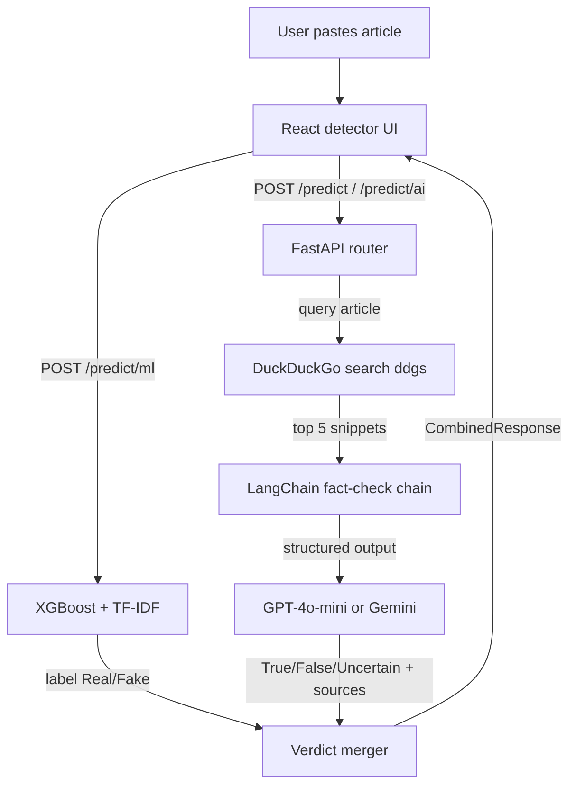

# FakeNews Detector

Dual-engine news verification — a local XGBoost classifier plus LLM fact-checking with live web sources, behind one FastAPI + React app.

## 1. Problem

Misinformation spreads faster than manual fact-checking can keep up with. A reader who wants to verify a suspicious article today has two bad options: trust their gut, or spend 20 minutes cross-searching claims across news sites.

Single-signal tools don't help much either. Keyword heuristics and browser extensions rely on one detection method, so they are either trivially fooled or too slow/opaque to be useful at the moment of sharing.

## 2. Solution

FakeNews Detector verifies any pasted article in seconds by running an on-device statistical model **and** an LLM-powered web fact-check, then merging the verdicts into one explainable answer.

- **Combined mode** — runs both engines and reconciles agreement/disagreement with boosted confidence and a written rationale
- **ML-only mode** — instant XGBoost + TF-IDF classification (Real/Fake), fully offline, no API key
- **AI-only mode** — searches the live web via DuckDuckGo, feeds evidence to GPT-4o-mini or Gemini, returns True/False/Uncertain with cited sources
- **Bring-your-own-key settings panel** — users store GPT or Gemini keys locally in the browser; requests forward them per-call
- **Local history sidebar** — every run is saved in `localStorage` and restorable with one click; no accounts, no server-side storage of user text beyond the request itself

## 3. Architecture

- **Frontend (`frontend/`)** — React 18 SPA (Vite). Four routes: Landing, `/detector`, `/features`, `/about`. Detector UI handles three modes, staged loading feedback, verdict/confidence/source rendering, history slide-over, and a settings modal for AI providers. Uses relative `/api/v1` URLs everywhere.
- **Backend (`backend/app/`)** — FastAPI. One router exposes three POST endpoints under `/api/v1`. In production the same process statically serves `frontend/dist`, so dev and deploy are both single-origin.
- **ML service (`services/ml_predictor.py`)** — loads `final_model(XGBoost).pkl` + `vectorizer.pkl` once via joblib; NLTK tokenization/stopword cleaning before TF-IDF transform.
- **AI pipeline (`services/predictor.py` → `searcher.py` → `core/llm.py`)** — DuckDuckGo search (top 5 results) → LangChain prompt chain → provider client (ChatOpenAI or ChatGoogleGenerativeAI) with Pydantic structured output.
- **Fusion logic (`api/routes.py`)** — rule-based merge of ML label and AI verdict into `final_verdict`.
- **Persistence** — model artifacts as pickle files in `app/ml_models/`; user history/settings only in the browser's `localStorage`.

## 4. Agent/workflow diagram



## 5. Tech stack

| Layer | Technology | Why |
|-------|-----------|-----|
| Frontend | React 18, Vite 5, React Router 6 | Fast SPA with route-level code splitting and instant HMR during development |
| Styling/motion | Tailwind CSS 3, Framer Motion 11 | CSS-variable design tokens (dark forest-green theme); declarative page transitions and micro-interactions |
| Backend | Python, FastAPI 0.115, Uvicorn | Async endpoints, automatic OpenAPI docs, native ASGI for serverless targets |
| ML | XGBoost ≥2.0, scikit-learn TF-IDF, NLTK, joblib | Proven text-classification baseline that runs offline with no API cost |
| AI verification | LangChain 1.x, ChatOpenAI (`gpt-4o-mini` default), ChatGoogleGenerativeAI (`gemini-1.5-flash`) | Provider swap is one class; structured output enforces the response schema |
| Web search | `ddgs` (DuckDuckGo) | Free, keyless evidence gathering for fact-checking |
| Storage | Pickle artifacts + browser `localStorage` | Zero infrastructure; nothing user-owned lives on the server |
| Deployment | Vercel (`@vercel/static-build` + `@vercel/python`) | One platform hosts both the SPA and the API function |

## 6. Key engineering decisions

- **Per-request BYOK credentials with env fallback** — `provider`/`api_key` travel in each request body and override `OPENAI_API_KEY`/`GOOGLE_API_KEY`, so API costs stay with end users. Trade-off: keys transit the server on every AI call.
- **Lazy LLM init cached per `(provider, key)` pair** (`core/llm.py`) — clients are built on first use instead of import time, which keeps ML-only deploys working with zero AI configuration. Trade-off: first AI request pays cold-start latency.
- **Rule-based fusion instead of a learned merger** — agreement boosts confidence to `max(ai, 0.85)`; disagreement defers to the AI for "False" verdicts and explains the conflict. Trade-off: interpretable and tunable, but not statistically optimized.
- **Same-origin static serving** — FastAPI mounts `frontend/dist` when it exists, eliminating CORS and a second local server. Trade-off: the SPA must be rebuilt before backend-only changes can be previewed.
- **Structured outputs via Pydantic (`with_structured_output(NewsResponse)`)** — the LLM must return the exact verdict schema or the call fails loudly. Trade-off: depends on provider support for schema-constrained decoding.
- **`localStorage` over a database** — history and settings never leave the browser without consent. Trade-off: history is device-bound and cleared with site data.

## 7. Screenshots

Drop real captures at these paths:

| File | Shows |
|------|-------|
| `docs/screenshots/landing.png` | Landing hero with animated background FX and detection mockup |
| `docs/screenshots/detector-loading.png` | Detector mid-analysis with staged progress steps |
| `docs/screenshots/detector-result.png` | Combined-mode result: verdict banner, confidence bar, model scores, cited sources |
| `docs/screenshots/settings-modal.png` | AI settings modal with GPT/Gemini provider cards and masked key input |

## 8. Demo

No public demo is hosted yet. To record one: run the stack locally (Installation below), paste any news paragraph in Combined mode, and capture the loading steps through the merged-verdict result screen as an animated GIF (`docs/demo.gif`).

Fastest local look after a prior build:

```bash
cd newspredict/backend && uvicorn main:app --app-dir app --port 8000
# open http://127.0.0.1:8000
```

## 9. Installation

Prerequisites: **Python 3.10+**, **Node.js 18+** (developed on Node 24), npm 11.

```bash
git clone <repo-url>
cd newspredict
```

1. **Backend dependencies**

   ```bash
   cd backend
   python -m venv .venv
   source .venv/bin/activate        # Windows: .venv\Scripts\activate
   pip install -r requirements.txt
   ```

2. **Optional env config** — copy `.env.example` to `.env` and fill `OPENAI_API_KEY` and/or `GOOGLE_API_KEY` (server-side fallbacks; users can also supply keys in-app via Settings).

3. **Frontend build**

   ```bash
   cd ../frontend
   npm install
   npm run build        # outputs frontend/dist, served by FastAPI
   ```

4. **Run**

   ```bash
   cd ../backend
   uvicorn main:app --app-dir app --reload --port 8000
   ```

   Open `http://127.0.0.1:8000`.

Frontend hot-reload alternative: `npm run dev` in `frontend/` serves `:5173` and proxies `/api` to `127.0.0.1:8000`.

## 10. API documentation

Interactive OpenAPI/Swagger UI at `http://127.0.0.1:8000/docs`.

| Method | Path | Request body | Response |
|--------|------|--------------|----------|
| POST | `/api/v1/predict` | `{text, provider?, api_key?}` | `CombinedResponse`: `ml_prediction`, `ai_verification?`, `final_verdict`, `confidence`, `explanation`, `sources[]` |
| POST | `/api/v1/predict/ml` | `{text}` | `MLPredictionResponse`: `label` ("Real"/"Fake"), `confidence`, `explanation`, `model` |
| POST | `/api/v1/predict/ai` | `{text, provider?, api_key?}` | `NewsResponse`: `verdict` ("True"/"False"/"Uncertain"), `confidence`, `explanation`, `sources[]` |
| GET | `/health` | — | `{"status": "ok"}` |

`provider` accepts `"gpt"` (OpenAI) or `"google"` (Gemini). When omitted, the server falls back to its env-configured key; if neither exists the AI endpoints return HTTP 400 with guidance.

Verified example — `POST /api/v1/predict/ml`:

```json
{"label":"Fake","confidence":0.0,"explanation":"The ML model classified this article as **Fake** news based on textual patterns learned from a dataset of real and fake news articles.","model":"XGBoost"}
```

## 11. Evaluation/results

No evaluation harness ships in the repository yet — no test suite, benchmark script, or held-out metrics file exists. The inherited documentation claims ~99% training-dataset accuracy for the XGBoost model (Kaggle "Fake and Real News" dataset); treat this as unverified since it is not reproducible from code in the repo.

| Metric | ML engine | AI engine | Combined |
|--------|-----------|-----------|----------|
| Accuracy | — | — | — |
| Precision (Fake) | — | — | — |
| Recall (Fake) | — | — | — |
| Latency p50/p95 | — | — | — |

Intended methodology: split the Kaggle corpus into stratified train/test sets (the shipped pickles were fit on the full set), re-train on the train split, score all three modes against ground truth, and measure per-mode latency over 100 requests.

## 12. Deployment

Target: **Vercel** (config files included).

| File | Role |
|------|------|
| `newspredict/vercel.json` | Single-project deploy — builds the SPA (`@vercel/static-build`) and routes `/api/*` to a Python function (`@vercel/python`, `maxDuration` 60 s) |
| `backend/api/index.py` + `backend/vercel.json` | Backend-only deploy; NLTK data downloads to writable `/tmp/nltk_data` at cold start |
| `frontend/vercel.json` | Frontend-only SPA deploy (rewrites + immutable asset caching); set `VITE_API_BASE=https://<backend>/api/v1` when split-hosting |

Deploy with `npx vercel` from the matching directory. Secrets (`OPENAI_API_KEY`, `GOOGLE_API_KEY`) belong in Vercel project environment variables, never in git — `.env` is gitignored and `.vercelignore`d. Scaling note: the Python function bundles XGBoost + scikit-learn + LangChain, which sits near AWS Lambda's 250 MB unpacked limit; if packaging fails, host the backend separately (Render/Railway/Fly) and point the frontend at it via `VITE_API_BASE`.

## 13. Limitations

- ML confidence is hardcoded to `0.0` — `predict()` exposes no probabilities, so the UI hides percentage scores for ML-only runs.
- The fusion rules are hand-tuned heuristics, not learned weights; adversarial disagreements between engines resolve by fixed precedence.
- Evidence search relies on free DuckDuckGo (`ddgs`) — subject to rate limits and result-quality variance, with no caching of repeated queries.
- English-only: NLTK stopwords, TF-IDF vocabulary, and prompts assume English articles.
- No auth, rate limiting, or input length caps beyond Pydantic's non-empty check; the API is open to abuse if deployed publicly.
- History/settings live in `localStorage` only — no sync, export, or cross-device persistence.
- Serverless bundle size (~XGBoost + sklearn + LangChain) risks exceeding Vercel's 250 MB function limit.
- AI explanations are generated content and can themselves be wrong; the UI carries a disclaimer but there is no source-verification step beyond link display.

## 14. Future improvements

1. Expose `predict_proba()` from XGBoost for real calibrated confidence scores.
2. Add an automated eval harness (stratified Kaggle hold-out) producing the metrics table above in CI.
3. Replace heuristic fusion with a small learned meta-classifier over `[ml_label, ml_proba, ai_verdict, ai_confidence]`.
4. Cache DuckDuckGo results (TTL-based) and add retry/backoff to survive rate limits.
5. Optional server-side history (opt-in account or encrypted export) for cross-device persistence.
6. Input hardening: max-length caps, per-IP rate limiting, and optional API tokens before any public launch.
